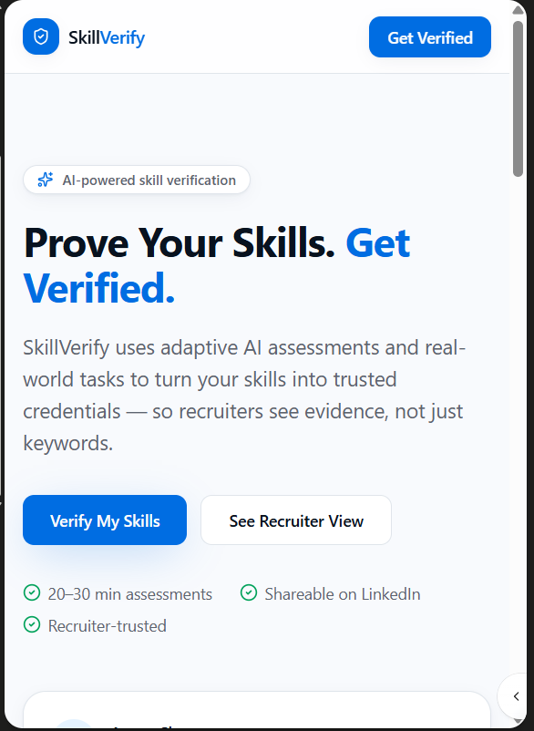
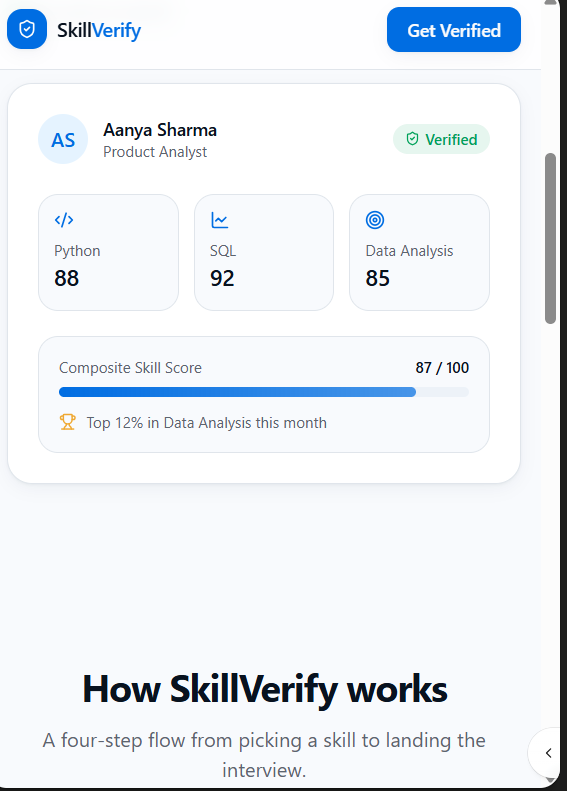
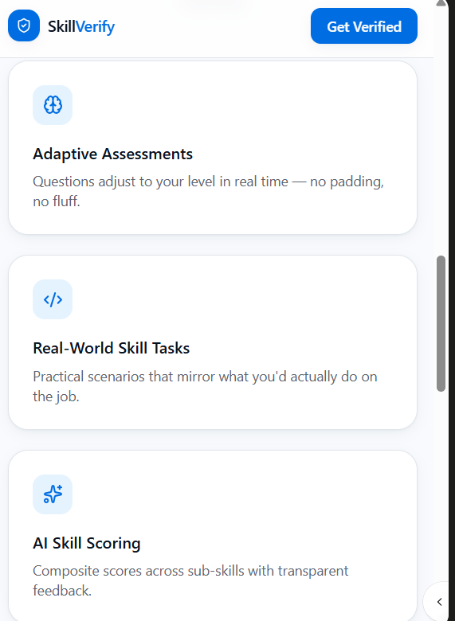
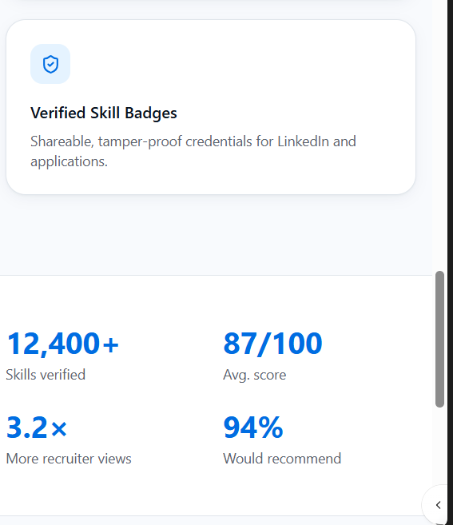
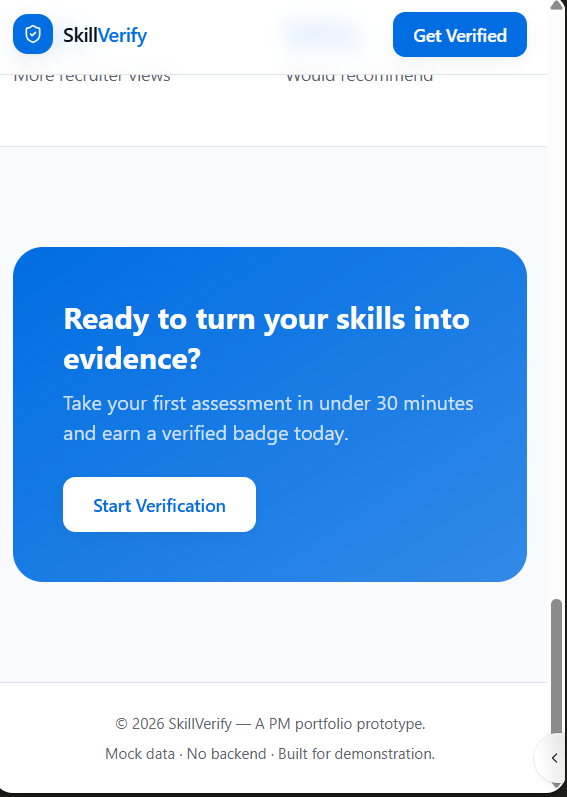

# SkillVerify – AI-Powered Skill Verification Platform

## Overview

SkillVerify is an AI-powered platform that helps professionals prove their skills through adaptive assessments and real-world tasks, generating trusted skill scores and verified badges.

## Problem

Recruiters often struggle to verify self-reported skills on resumes and LinkedIn profiles. Candidates with genuine skills also find it difficult to stand out from others who make similar claims.

## Solution

SkillVerify combines adaptive assessments, practical tasks, and AI-powered scoring to create trusted skill verification badges that can be shared on LinkedIn, resumes, and professional portfolios.

## Features

* Adaptive Assessments
* Real-World Skill Tasks
* AI-Powered Skill Scoring
* Verified Skill Badges
* Recruiter Dashboard

## Screenshots

### 🏠 Landing Page

The landing page introduces SkillVerify's core value proposition: helping professionals transform self-reported skills into trusted, verified credentials. Users are presented with a clear call-to-action to begin the verification process, along with an overview of the platform's key benefits.

---

### 👤 Verified Candidate Profile

The Verified Candidate Profile demonstrates how recruiters can quickly evaluate a candidate's proven skills and qualifications. The screen highlights the candidate's Composite Skill Score, verified skill badges, and assessment performance across multiple competency areas.

---

### ⚡ How SkillVerify Works

This section illustrates the end-to-end verification journey, from skill selection and adaptive assessments to AI-powered evaluation and badge generation.

---

### 🏆 Verified Skill Badges & Platform Statistics

This screen showcases earned skill badges along with platform metrics that reinforce trust and credibility in the verification process.

---

### 🚀 Call to Action

The final section encourages users to begin the verification process and earn trusted credentials that can be showcased across professional platforms.

## Live Demo

[View Live Prototype](https://lovable.dev/projects/ed053f01-ab12-47d0-bca3-7c5823a10b8c)

## Author

Ashna Adil

